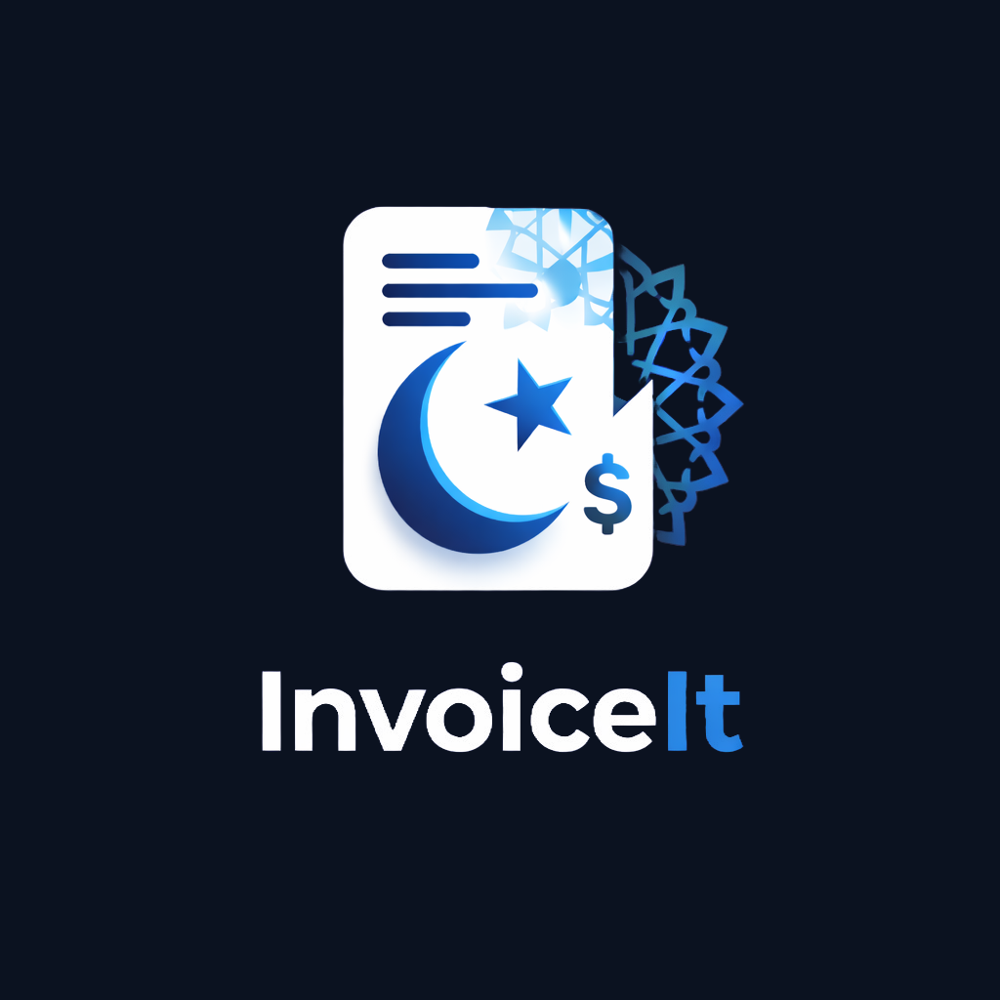

# InvoiceIt 📱
> **Professional Billing Made Simple.**  
> The ultimate offline-first invoicing solution for Android.

## 🚀 Overview
**InvoiceIt** is a premium, native Android application designed for freelancers, contractors, and small business owners who need a powerful, reliable, and beautiful way to manage billing on the go. 

Unlike other apps that rely on cloud subscriptions, **InvoiceIt is 100% offline-first**, ensuring your financial data stays private, secure, and always accessible—even without an internet connection.

---

## ✨ Key Features

### 🔒 Privacy & Security
- **Offline First Architecture**: All data is stored locally on your device. Zero cloud dependencies.
- **No Tracking**: We don't track your clients or your income. Your business is yours alone.

### ⚡ Smart Invoicing
- **Instant PDF Generation**: Create professional, branded PDF invoices in milliseconds.
- **Auto-Calculations**: Automatic tax, discount, and total calculations.
- **Invoice Builder**: Intuitive drag-and-drop style builder to add items quickly.

### ✍️ Digital Signatures
- **Built-in Signature Pad**: Sign invoices directly on your screen.
- **Biometric Security**: (Coming Soon) Secure your app with fingerprint/FaceID.

### 👥 Client & Item Management
- **Customer Address Book**: Save client details for one-tap invoice creation.
- **Product Inventory**: key frequently used items/services with predefined prices.

### 🎨 Stunning UI/UX
- **Glassmorphism Design**: A modern, sleek interface built with Jetpack Compose.
- **Dark Mode First**: Easy on the eyes, perfect for working late nights.
- **Smooth Animations**: A fluid experience that feels alive.

### 🌍 Global Ready
- **Multi-Currency Support**: Out-of-the-box support for:
  - 🇺🇸 USD ($)
  - 🇪🇺 EUR (€)
  - 🇬🇧 GBP (£)
  - 🇮🇳 INR (₹)
  - 🇵🇰 PKR (Rs)
  - 🇯🇵 JPY (¥)

---

## 🛠️ Tech Stack
Built with cutting-edge Android technologies:
- **Language**: Kotlin
- **UI Toolkit**: Jetpack Compose (Material 3)
- **Architecture**: MVVM + Clean Architecture
- **Data Persistence**: Local JSON / Room Database
- **PDF Generation**: Android Canvas API

---

## 📥 Download
Get the latest version directly from our website:
[Download APK](app.apk)

---

## 👨‍💻 Developer
Developed with ❤️ by **Ayaan**.  
*Passionate Game & App Developer.*

[Support on Patreon](https://www.patreon.com/c/GameDevAyaan) | [YouTube Channel](https://www.youtube.com/@GameDev-Ayaan)

---

*© 2026 GameDev Ayaan Creations. All rights reserved.*
